# Claude Pipeline Wizard UML 클래스 다이어그램

이 프로젝트는 계층형 백엔드(Rust, `src-tauri/src/`)와 얇은 프론트엔드 타입 미러(TypeScript,
`src/types.ts`)로 구성된다. 아래 다이어그램은 Rust 쪽 실제 구조체/enum/impl 블록을
Domain(도메인 모델) / Store(영속성) / Engine(실행 엔진) / Command(IPC 진입점) 네임스페이스로
묶어 표현한다.

> **표기 주의**: 이 문서는 HTML 포털에 삽입되므로 Mermaid classDiagram에서 `<` 문자를
> 만드는 표기(상속 화살표 `<|--`, 제네릭 `<T>`, 스테레오타입 `<<...>>`)를 모두 피했다.
> 상속/구현 관계는 방향을 반대로 쓴 `--|>` / `..|>` 로 표기한다.

```mermaid
classDiagram
    namespace Domain {
        class Template {
            +string id
            +string name
            +string description
            +Stage_list stages
        }
        class Stage {
            +string id
            +string name
            +string prompt
            +PermissionMode permissionMode
            +string_list allowedTools
            +bool checkpoint
        }
        class PermissionMode {
            AcceptEdits
            BypassPermissions
            Default
        }
        class TemplateValidationError {
            NoStages
            EmptyPrompt(stageId)
            DuplicateStageId(stageId)
            InvalidId(id)
        }
    }

    namespace Engine_Domain {
        class RunRecord {
            +string runId
            +string templateId
            +string targetDir
            +RunStatus status
            +usize currentStageIndex
            +StageRun_list stages
            +Stage_list resolvedStages
            +new(runId templateId targetDir stageIds) RunRecord
            +currentStageMut() StageRun
            +currentResolvedStage() Stage
            +applyStageOverride(stage) Result
            +beginCurrentStage()
            +advanceToGate(sessionId) bool
            +markCurrentAwaitingCheckpoint(sessionId)
            +markCurrentFailed()
            +approveCurrent() bool
            +cancel()
        }
        class StageRun {
            +string id
            +StageStatus status
            +string sessionId
            +JsonValue_list log
        }
        class RunStatus {
            Running
            AwaitingStageStart
            AwaitingCheckpoint
            Completed
            Failed
            Cancelled
        }
        class StageStatus {
            Pending
            AwaitingStart
            Running
            AwaitingCheckpoint
            Approved
            Failed
        }
        class StageOverrideError {
            StageIdMismatch(expected got)
        }
        class StageEvent {
            Init(sessionId)
            AssistantText(text)
            ToolUse(name input)
            ToolResult(content)
            Result(sessionId success result)
            ProcessError(exitCode stderr)
            Unknown(raw)
        }
    }

    namespace Store {
        class TemplateStore {
            -PathBuf dir
            +new(dir) TemplateStore
            +list() Template_list
            +load(id) Template
            +save(template)
            +delete(id)
        }
        class RunRecordStore {
            -PathBuf dir
            +new(dir) RunRecordStore
            +save(record)
            +load(runId) RunRecord
        }
        class StoreError {
            Io(err)
            Json(err)
            Validation(err)
            NotFound(id)
            InvalidId(id)
        }
        class RunRecordStoreError {
            Io(err)
            Json(err)
            NotFound(runId)
            InvalidId(runId)
        }
    }

    namespace Engine_Execution {
        class ExecutorConfig {
            +string claudeBinary
            +Duration stageTimeout
            +KeyValue_list extraEnv
        }
        class Executor {
            +runStage(config stage targetDir resumeSessionId onEvent) i32
        }
        class Orchestrator {
            +TemplateStore templateStore
            +RunRecordStore runStore
            +ExecutorConfig executorConfig
            -RunLocks runLocks
            +new(templateStore runStore executorConfig) Orchestrator
            +startRun(templateId targetDir runId) RunRecord
            +startStage(runId expectedStageIndex stageOverride onEvent) RunRecord
            -runCurrentStage(record targetDir resumeSessionId onEvent) RunRecord
            +approveCheckpoint(runId onEvent) RunRecord
            +requestChanges(runId feedback onEvent) RunRecord
            +rejectCheckpoint(runId) RunRecord
            +cancelRun(runId) RunRecord
            -save(record)
            -saveWithRollback(record snapshot)
            -lockFor(runId) Mutex
        }
        class OrchestratorError {
            TemplateStore(err)
            RunRecordStore(err)
            Io(err)
            NotAwaitingCheckpoint(runId)
            NotAwaitingStageStart(runId)
            StageIdMismatch(expected got)
            StaleStageIndex(expected actual)
            TargetDirInUse(path)
            NotCancellable(runId)
        }
        class ProjectManifest {
            +writeProjectManifest(targetDir record)
            +validateTargetDir(targetDir) Result
            +manifestDir(targetDir) PathBuf
        }
    }

    namespace Command {
        class TauriCommands {
            +listTemplates(orchestrator) Template_list
            +loadTemplate(orchestrator id) Template
            +saveTemplate(orchestrator template)
            +deleteTemplate(orchestrator id)
            +checkCli(orchestrator) string
            +startPipelineRun(orchestrator templateId targetDir runId) RunRecord
            +startStage(app orchestrator runId expectedStageIndex stageOverride) RunRecord
            +cancelRun(orchestrator runId) RunRecord
            +getRun(orchestrator runId) RunRecord
            +approveCheckpoint(app orchestrator runId) RunRecord
            +requestChanges(app orchestrator runId feedback) RunRecord
            +rejectCheckpoint(orchestrator runId) RunRecord
        }
        class CliCheck {
            +checkClaudeCli(binary) CliCheckResult
        }
        class CliCheckResult {
            Available(version)
            NotFound
        }
    }

    Template "1" --> "1..*" Stage : stages에 내장
    Template ..> TemplateValidationError : validateTemplate에서 반환

    RunRecord "1" --> "1..*" StageRun : stages에 내장
    RunRecord --> RunStatus : status
    StageRun --> StageStatus : status
    StageEvent ..> StageRun : log에 직렬화되어 누적

    TemplateStore ..> Template : load/save 대상
    TemplateStore ..> StoreError : 실패 시 반환
    RunRecordStore ..> RunRecord : load/save 대상
    RunRecordStore ..> RunRecordStoreError : 실패 시 반환

    Orchestrator --> TemplateStore : 사용
    Orchestrator --> RunRecordStore : 사용
    Orchestrator --> ExecutorConfig : 사용
    Orchestrator ..> Executor : runStage 호출
    Orchestrator ..> OrchestratorError : 실패 시 반환
    Orchestrator ..> ProjectManifest : 매 전이마다 씀
    RunRecord ..> StageOverrideError : applyStageOverride 실패 시 반환
    Executor ..> StageEvent : 파싱 및 emit
    Executor --> ExecutorConfig : 설정 참조

    TauriCommands --> Orchestrator : State로 주입받아 위임
    TauriCommands ..> CliCheck : checkCli에서 호출
    CliCheck --> CliCheckResult : 반환
    OrchestratorError ..> StoreError : from 변환
    OrchestratorError ..> RunRecordStoreError : from 변환
```

## 계층 설명

| 네임스페이스 | 파일 | 책임 |
|---|---|---|
| `Domain` | `template/mod.rs` | 템플릿/단계 정의와 순수 검증 로직 (`validate_template`). 저장 방식을 모른다 |
| `Engine_Domain` | `engine/run_record.rs`, `engine/stream_json.rs` | 실행 상태 머신의 데이터 모델과 상태 전이 메서드, `claude` stdout 파싱 결과 타입 |
| `Store` | `template/store.rs`, `engine/run_record.rs`(저장소 부분) | JSON 파일 CRUD, id 검증(path traversal 방지) |
| `Engine_Execution` | `engine/executor.rs`, `engine/orchestrator.rs`, `engine/project_manifest.rs` | `claude` 자식 프로세스 스폰/스트리밍, 게이트/체크포인트 상태 머신, `<targetDir>` 매니페스트 쓰기 |
| `Command` | `commands.rs`, `cli_check.rs` | Tauri IPC 진입점 — 위 계층들을 얇게 감싸 `Result<T, String>`으로 변환 |

## 주요 설계 포인트

- **`Orchestrator`가 조합 루트(composition root)** 다 — `TemplateStore`, `RunRecordStore`,
  `ExecutorConfig`를 하나로 묶어 Tauri `State`로 등록된다(`lib.rs`). 커맨드 레이어는
  이 `Orchestrator` 하나만 알면 된다.
- **`Orchestrator`는 더 이상 루프를 돌지 않는다** — 예전의 `drive()`는 제거됐다. `startRun`은
  1단계의 실행 전 게이트(`AwaitingStageStart`)에서 곧바로 반환하고, `startStage` 호출 1번이
  단계 1개를 실행한다. 체크포인트가 없는 단계가 끝나도, 체크포인트를 승인해도 결과는
  같다 — `advanceToGate()`로 다음 단계의 게이트로 돌아갈 뿐 다음 `startStage`가
  자동으로 이어지지 않는다. run별 락(`lockFor`)이 상태 로드-검사-저장 구간을 직렬화하고,
  자식 프로세스를 기다리는 동안에는 락을 쥐지 않는다.
- **검증은 두 레이어에 중복 존재한다** — `TemplateStore.save()`가 호출하는
  `validate_template()`(Rust)과 프론트엔드 `TemplateEditor.tsx`의 `validate()`(TS)가
  같은 규칙(빈 프롬프트 금지, id 패턴, 중복 id 금지)을 각각 구현한다. 백엔드가 최종
  방어선이다.
- **`StageEvent`는 두 가지 생성 경로를 가진다** — 대부분은 `stream_json::parse_line()`이
  `claude` stdout 한 줄을 파싱해 만들지만, `ProcessError`만은 `executor.rs`가 프로세스
  실패/타임아웃 상황에서 직접 합성한다(→ [시퀀스 다이어그램](sequence-diagrams.md) 3절).
