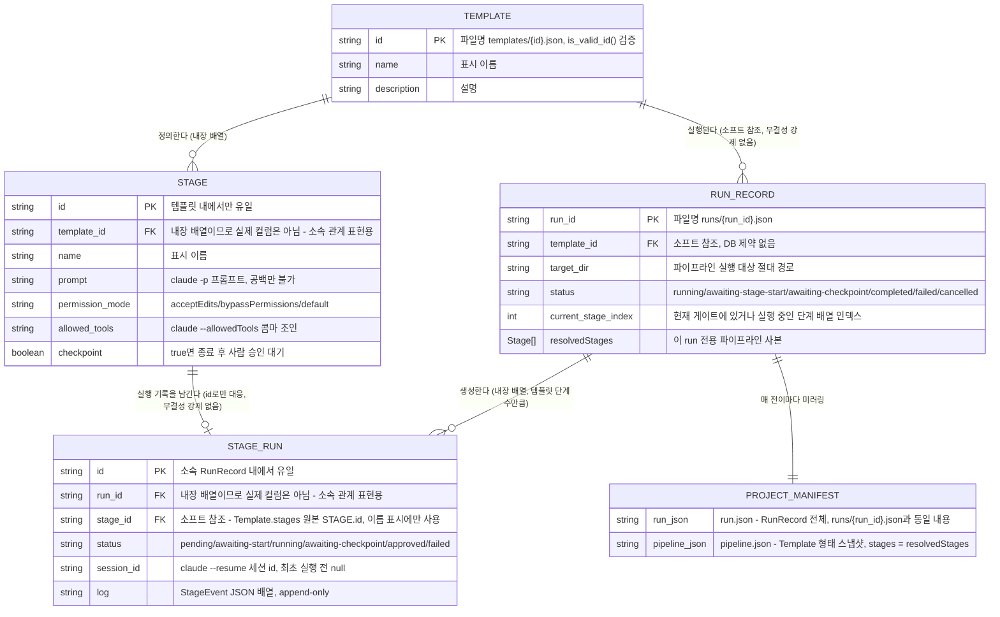

# Claude Pipeline Wizard ER 다이어그램

**주의**: 이 프로젝트는 DBMS를 사용하지 않는다(→ [DB 설계 문서](database-design.md) 참고).
아래 다이어그램은 실제 SQL 테이블이 아니라 **JSON 파일로 저장되는 Rust 구조체 두 묶음**
(`Template`↔`Stage`, `RunRecord`↔`StageRun`)의 관계를 ER 표기법으로 표현한 것이다.
`||--o{`, `PK`, `FK` 등의 표기는 관계의 "성격"을 설명하기 위한 것이며, 실제로 DB 제약조건이
걸려 있다는 뜻은 아니다 — `RunRecord.templateId → Template.id` 관계는 애플리케이션 코드가
실행 시점에만 조회하는 **소프트 참조**다(강제되는 외래키 제약 없음).

## 표기 설명

| 표기 | 의미 |
|---|---|
| `||--o{` | 1 : 0 이상 — 예: 템플릿 하나가 여러 단계를 가짐 |
| `||--o|` | 1 : 0 또는 1 — 예: 단계 하나에 대응하는 실행 기록이 아직 없을 수도 있음(런이 그 단계까지 도달하지 않은 경우) |
| `PK` | 해당 저장소(디렉터리) 안에서 파일명 역할을 하는 필드 |
| `FK` | 다른 엔티티를 가리키는 필드. **DB 제약으로 강제되지 않음** — 애플리케이션 코드가 필요할 때마다 조회 |

## 관계별 상세 설명

1. **TEMPLATE ||--o{ STAGE** — `Template.stages: Vec<Stage>`. 별도 파일이 아니라 같은
   `templates/{id}.json` 안에 배열로 내장된다. 단계 순서는 배열 순서 자체가 곧 실행 순서다.
2. **RUN_RECORD ||--o{ STAGE_RUN** — `RunRecord.stages: Vec<StageRun>`. `RunRecord::new()`
   호출 시점에 원본 템플릿의 단계 수만큼 `Pending` 상태로 미리 생성된다(→
   [클래스 다이어그램](class-diagram.md)의 `RunRecord::new` 참고).
3. **TEMPLATE ||--o{ RUN_RECORD** — 하나의 템플릿으로 여러 번 실행할 수 있다.
   `RunRecord.templateId`가 원본 `Template.id`를 문자열로 들고 있을 뿐이며, 템플릿이
   삭제/수정되어도 기존 `RunRecord`는 영향받지 않는다(체크포인트 승인 시점에 다시 로드를
   시도할 때만 실패로 드러난다 → [DB 설계 문서](database-design.md) 3절).
4. **STAGE ||--o| STAGE_RUN** — `StageRun.id`가 원본 `Stage.id`와 문자열이 같을 때만
   같은 단계로 간주된다. 이 매칭은 프론트엔드의 표시 이름 조회(`stageNameById`)에만
   쓰이고, 백엔드 로직은 인덱스(`currentStageIndex`)로 단계를 진행시킨다.
5. **RUN_RECORD ||--|| PROJECT_MANIFEST** — `Orchestrator::save()`가 모든 상태 전이마다
   `runs/{run_id}.json`을 쓴 직후 `<targetDir>/.claude-pipeline-wizard/`에도 같은
   `RunRecord`를 미러링한다. 매니페스트 쓰기가 실패하면 방금 쓴 `runs/`쪽 전이까지
   롤백된다(→ [DB 설계 문서](database-design.md) 2.3절).
6. **RunRecord.resolvedStages는 Template.stages에서 복사된다** — `RunRecord::new()`가
   생성 시점에 템플릿 `stages`를 통째로 복사하고, 그 뒤로는 원본과 독립적으로 변한다.
   실행 전 게이트에서 프롬프트를 고쳐도 `apply_stage_override`가 이 복사본 한 인덱스만
   교체할 뿐이며, 원본 `templates/{id}.json`은 어떤 경로로도 쓰지 않는다 — 이 복사가
   원본 템플릿 오염을 구조적으로 막는다.
