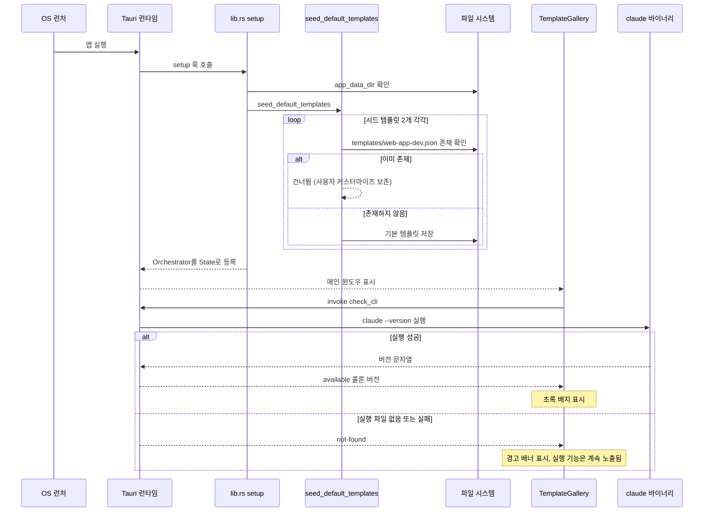
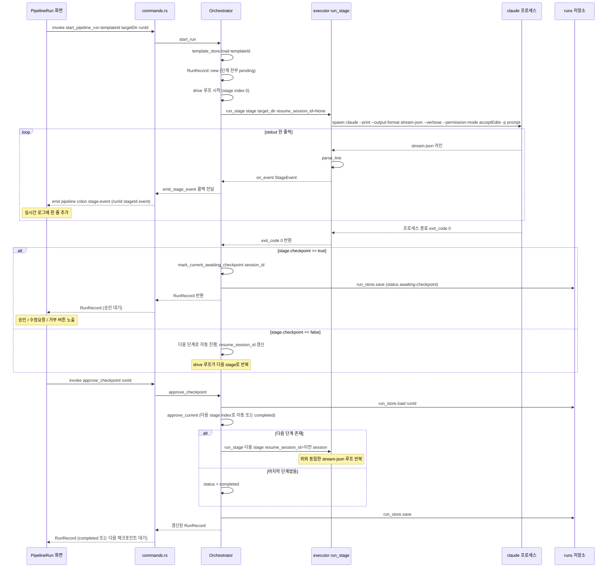
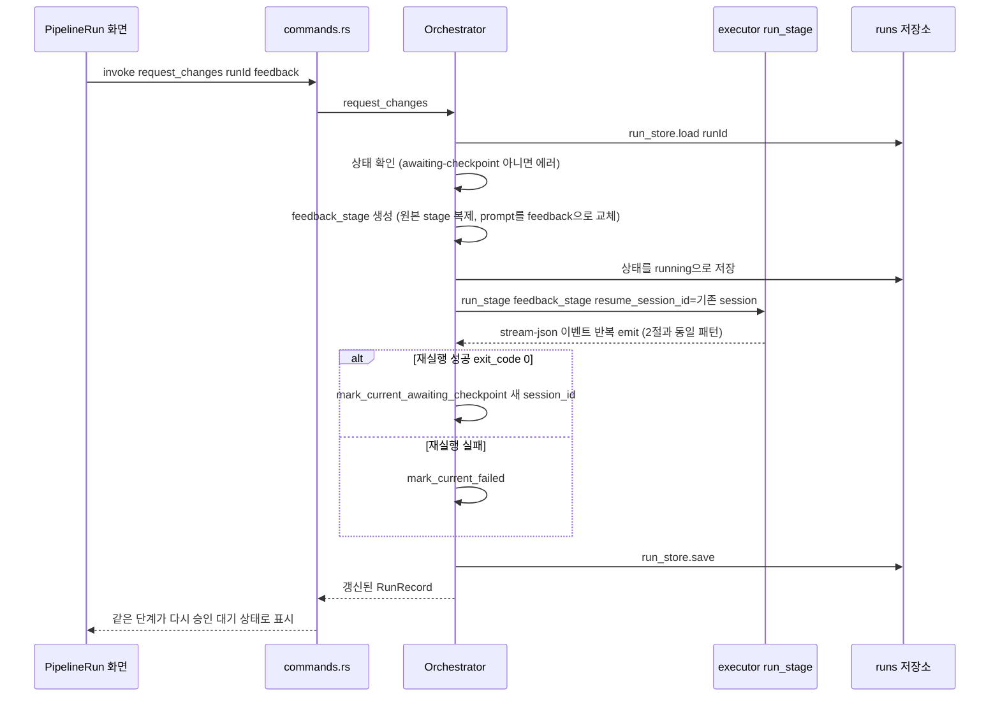
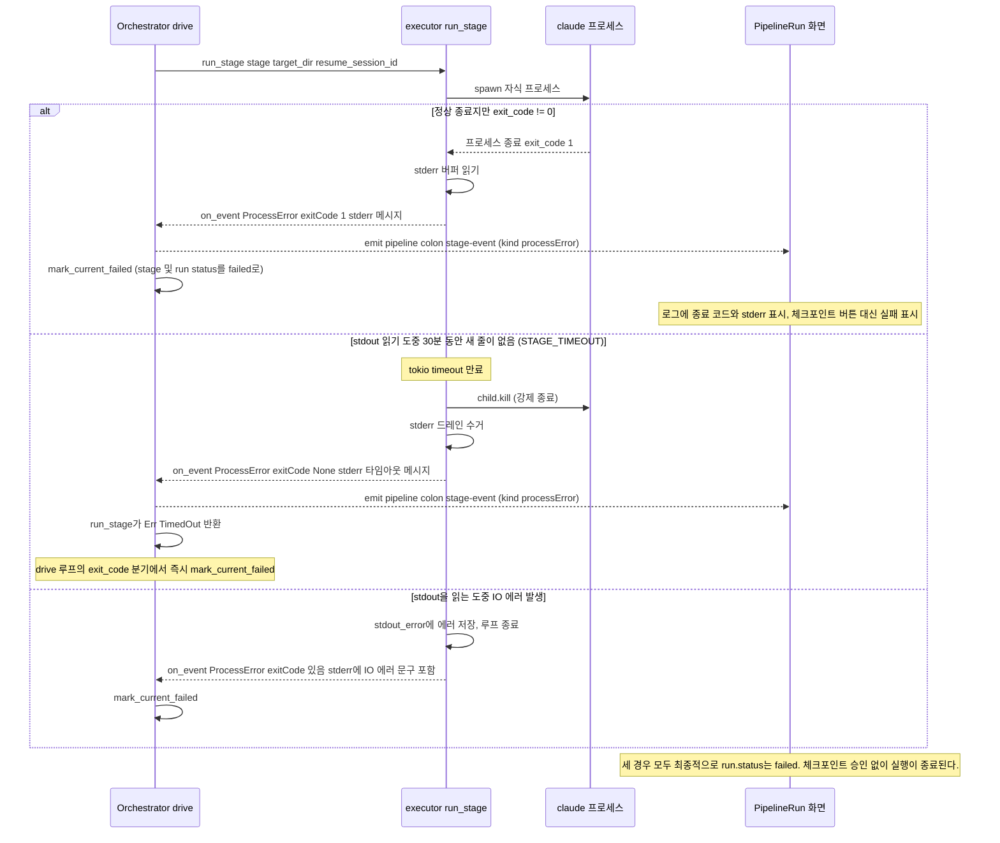
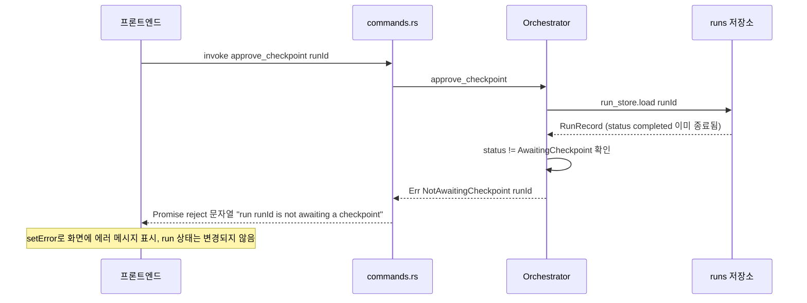

# Claude Pipeline Wizard UML 시퀀스 다이어그램

**참고**: 이 앱은 로그인/회원가입 같은 사용자 인증이 없는 로컬 단일 사용자 데스크톱 앱이다
(→ [API 설계 문서](api-design.md) 1절). 따라서 스킬 템플릿이 요구하는 "인증 플로우" 자리에는
이 앱에서 실제로 존재하는 가장 가까운 개념인 **앱 부팅 및 CLI 가용성 확인 플로우**를 담았다 —
"토큰 발급"을 대체하는 게 아니라, 이 프로젝트에 인증이 없다는 사실 자체를 문서화한 것이다.

---

## 1. 앱 부팅 및 CLI 가용성 확인 플로우

앱 시작 시 시드 템플릿을 생성하고, 갤러리 화면이 `claude` CLI 설치 여부를 확인하는 흐름.
(→ `src-tauri/src/lib.rs`의 `setup()`, `src/pages/TemplateGallery.tsx`)

---

## 2. 핵심 비즈니스 로직 — 파이프라인 실행부터 체크포인트 승인까지

이 앱에서 가장 중요한 흐름: 템플릿을 골라 실행하고, 첫 단계가 끝나면 체크포인트에서
멈춰 사람이 승인한 뒤 다음 단계로 이어지는 전체 과정.
(→ `src-tauri/src/engine/orchestrator.rs`, `executor.rs`, `commands.rs`)

### 2.1 보조 흐름 — 수정 요청 보내기

체크포인트에서 "승인" 대신 "수정 요청 보내기"를 선택했을 때, 같은 단계를 사람이 입력한
피드백으로 재실행하는 흐름.

---

## 3. 에러 처리 플로우 — claude 프로세스 실패 / 타임아웃

`claude` CLI가 비정상 종료하거나 30분간 응답이 없을 때의 처리 흐름.
(→ `src-tauri/src/engine/executor.rs`)

### 3.1 잘못된 상태에서의 커맨드 호출 (검증 에러)

이미 완료되었거나 취소된 런에 대해 승인/거부/수정 요청을 시도할 때의 방어 로직.

