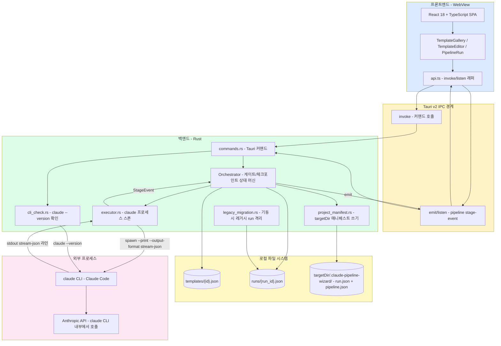
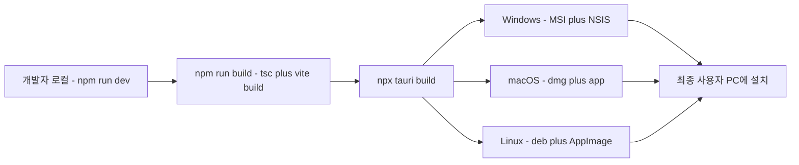

# Claude Pipeline Wizard 시스템 아키텍처

**버전**: v0.1.0
**작성일**: 2026-09-07

---

## 1. 시스템 개요

| 항목 | 내용 |
|------|------|
| 시스템명 | Claude Pipeline Wizard |
| 목적 | 재사용 가능한 다단계 "파이프라인 템플릿"(예: 웹 앱 개발, Tauri 데스크톱 앱 개발)을 정의해 두고, Claude Code CLI를 단계별로 호출해 새 프로젝트 폴더에 대해 실행하며, 단계마다 사람이 승인/거부/수정요청으로 개입할 수 있게 하는 로컬 오케스트레이션 도구 |
| 주요 사용자 | Claude Code CLI를 이미 설치·로그인한 개인 개발자 (로컬 단일 사용자) |
| 배포 형태 | 서버 없음 — OS별 데스크톱 설치 패키지(MSI/NSIS, DMG, DEB/AppImage)로 배포되는 단일 실행 파일 |
| 예상 동시 사용자 | 1명 (앱 인스턴스당 로컬 사용자 1명, 네트워크 포트를 열지 않음) |

이 앱 자체는 AI 모델을 호출하지 않는다 — 사용자의 PATH에 이미 설치된 `claude` CLI
프로세스를 스폰하고, 그 표준출력(`stream-json` 포맷)을 파싱해 UI에 실시간으로 보여주는
**얇은 영속 오케스트레이션 레이어**다(→ README.md).

---

## 2. 전체 아키텍처 다이어그램

---

## 3. 컴포넌트 설명

| 컴포넌트 | 기술 | 책임 |
|---------|------|------|
| React SPA (`src/`) | React 18 + TypeScript, Vite | 3개 화면(갤러리/에디터/실행) 렌더링, 사용자 입력 수집, `api.ts`를 통한 IPC 호출/구독 |
| `api.ts` | `@tauri-apps/api` | 프론트엔드의 유일한 IPC 진입점 — `invoke()`/`listen()`을 타입이 붙은 함수로 감쌈 |
| Tauri Runtime | Tauri v2 (Rust) | WebView 호스팅, IPC 브리지, 네이티브 다이얼로그(`@tauri-apps/plugin-dialog`)로 폴더 선택 제공 |
| `commands.rs` | Rust | IPC 진입점. 모든 로직을 `Orchestrator`/`cli_check`에 위임하고 에러를 `String`으로 변환 |
| `Orchestrator` (`engine/orchestrator.rs`) | Rust | 파이프라인 상태 머신의 중심. 단계 순차 실행, 체크포인트 일시정지/재개, 실패 처리 |
| `Executor` (`engine/executor.rs`) | Rust + `tokio::process` | `claude` 자식 프로세스 스폰, stdout을 줄 단위로 비동기 파싱, 30분 타임아웃 강제 |
| `TemplateStore` / `RunRecordStore` | Rust + `serde_json` | JSON 파일 기반 CRUD, id 검증(path traversal 방지) — → [DB 설계 문서](database-design.md) |
| `cli_check.rs` | Rust | `claude --version` 실행 결과로 CLI 설치 여부 판별 |
| `project_manifest` (`engine/project_manifest.rs`) | Rust + `serde_json` | 대상 폴더 검증(절대 경로 요구)과 `<targetDir>/.claude-pipeline-wizard/{run,pipeline}.json` 쓰기. 상태 머신을 모르며, 넘겨받은 `RunRecord`를 직렬화할 뿐이다 |
| `legacy_migration` (`engine/legacy_migration.rs`) | Rust | 기동 시 1회, `resolvedStages`가 없는 구 형식 run 레코드를 `runs-legacy-v1/`로 이동. 실패해도 기동을 막지 않는다 |
| `claude` CLI | 외부 프로세스 (사용자 PATH) | 실제 AI 추론/도구 실행을 수행. 이 앱은 이 프로세스의 입출력만 다룬다 |
| `mock_claude` (`bin/mock_claude.rs`) | Rust 테스트 바이너리 | Rust 통합 테스트에서 `claude` CLI를 대체하는 결정적 스텁 |

---

## 4. 기술 스택 선정 이유

| 기술 | 선정 이유 |
|------|----------|
| Tauri v2 | 네이티브 프로세스 스폰(`tokio::process`)과 파일 시스템 접근이 필요한 로컬 오케스트레이션 도구에 적합, Electron 대비 훨씬 작은 바이너리, Rust의 타입 안전성 |
| React + TypeScript | Tauri 프론트엔드의 사실상 표준 조합, `types.ts`로 Rust `serde` 타입을 그대로 미러링해 IPC 경계의 타입 불일치를 줄임 |
| `tokio` (`rt-multi-thread`, `process`) | `claude` 프로세스의 stdout/stderr를 논블로킹으로 동시에 읽고, `tokio::time::timeout`으로 행(hang) 방지 |
| JSON 파일 저장 (DBMS 미사용) | 단일 사용자 로컬 도구에서 SQLite/Postgres 같은 DBMS를 도입할 만큼의 동시성/쿼리 요구가 없음 — 사람이 직접 파일을 열어 디버깅하기도 쉬움(→ [DB 설계 문서](database-design.md) 0절) |
| `thiserror` | Rust 에러 타입에 사람이 읽을 수 있는 메시지를 붙이고, `commands.rs`에서 `.to_string()`으로 손쉽게 IPC 경계를 넘김 |
| `stream-json` 파싱 자체 구현 | `claude` CLI가 제공하는 유일한 기계 판독 가능 출력 포맷을 그대로 소비 — 별도 SDK 불필요 |

---

## 5. 데이터 흐름

1. 앱 기동 시 `legacy_migration`이 `runs/`의 구 형식 레코드를 `runs-legacy-v1/`로
   격리한다(1회, 멱등, 실패해도 기동 계속).
2. 사용자가 갤러리 카드의 **실행**을 누르고 대상 폴더를 고른다 → `start_pipeline_run`
   호출. 이 커맨드는 **어떤 프로세스도 스폰하지 않는다** — 템플릿을 로드해 `RunRecord`를
   만들고 `runs/{run_id}.json`과 `<targetDir>/.claude-pipeline-wizard/{run,pipeline}.json`에
   저장한 뒤 즉시 반환한다. run은 `awaiting-stage-start`, 즉 **1단계 실행 전 게이트**에서
   멈춘다.
3. 실행 화면이 `resolvedStages[currentStageIndex]`로 편집 패널을 채운다. 사용자는
   프롬프트·권한 모드·허용 도구·체크포인트를 이 run에 한해 수정할 수 있다(원본 템플릿은
   쓰지 않는다). 단계 ID만은 표시되되 잠겨 있다.
4. **이 단계 실행**을 누르면 `start_stage(runId, expectedStageIndex, stageOverride)`가
   호출된다. run별 뮤텍스와 `expectedStageIndex` 세대 검사를 모두 통과한 호출만
   `Executor`로 내려가 `claude` 프로세스를 **정확히 하나** 스폰한다. stdout의 각 줄이
   `StageEvent`로 파싱되어 `pipeline://stage-event`로 프론트엔드까지 실시간 전달된다.
5. 프로세스가 종료되면 결과에 따라 `RunRecord`가 갱신되고 두 저장소에 다시 저장된다.
   - 실패/타임아웃 → `failed`. **종료 상태이며 이 run에서는 재시도할 수 없다**(새 run 필요).
   - 체크포인트 단계 → `awaiting-checkpoint`에서 승인/수정요청/거부를 기다린다.
   - 그 외 → **자동으로 다음 단계를 실행하지 않고** 다음 단계의 게이트로 복귀한다.
6. 체크포인트를 승인해도 결과는 같다 — 다음 단계의 게이트로 복귀할 뿐이다. 즉 **정지
   지점은 두 곳이다: 모든 단계의 실행 직전, 그리고 체크포인트 단계의 실행 직후.**
   `claude` 프로세스는 사용자가 **이 단계 실행**을 누를 때만 뜬다.
7. 마지막 단계가 승인/완료되면 `RunRecord.status`가 `completed`가 되며 흐름이 끝난다.
   어느 게이트에서든 **이 run 취소**로 `cancelled` 종료가 가능하다.

전체 흐름의 이벤트 단위 상세는 → [시퀀스 다이어그램](sequence-diagrams.md) 참고.

---

## 6. 배포 아키텍처

서버 배포 파이프라인(CI/CD, 컨테이너 레지스트리, 클라우드 인프라)이 없다 — 이 항목들은
아키텍처상 존재하지 않는다. 배포 산출물은 로컬에서 `scripts/build/build.*`,
`scripts/installer/build-installer.*`로 생성되는 설치 패키지뿐이다(→
[사용 설명서](user-guide.md) 참고).

---

## 7. 비기능 요구사항

| 항목 | 정책/목표 |
|---|---|
| 성능 | 단계당 `claude` 프로세스 stdout을 줄 단위로 즉시 파싱·emit — UI 반영 지연은 프로세스 자체의 출력 속도에 의존 |
| 타임아웃 | 단계 하나가 30분(`STAGE_TIMEOUT`) 동안 stdout 출력이 없으면 강제 종료 |
| 보안 — 경로 검증 | 템플릿 id/단계 id/실행 id 모두 `is_valid_id()`로 검증해 `..`, `/` 등을 이용한 path traversal을 방지 |
| 보안 — 프로세스 권한 | `permissionMode`(`acceptEdits`/`bypassPermissions`/`default`)를 통해 `claude` CLI 자체의 파일 수정 권한 정책을 단계별로 제어. 헤드리스 실행이라 도중에 대화형으로 권한을 승인할 수 없다는 제약이 있음 |
| 보안 — 자격증명 | 이 앱은 API 키/토큰을 직접 다루지 않는다 — 인증은 사용자가 이미 로그인해 둔 `claude` CLI에 위임됨 |
| 확장성 | 단일 사용자 로컬 앱이므로 수평 확장 개념이 적용되지 않음. 여러 run을 동시에 열 수 있으며, run 하나의 load-check-save 구간은 run별 `tokio::sync::Mutex`로 직렬화된다(자식 프로세스 대기 구간에는 락을 잡지 않는다) |
| 복구성 | 모든 상태 전이가 `runs/{run_id}.json`과 `<targetDir>/.claude-pipeline-wizard/`에 즉시 저장된다. 다만 **매니페스트는 사람이 읽기 위한 것이지 앱이 다시 읽어들이지 않는다** — 앱 재시작 후 진행 중이던 run을 다시 여는 UI는 여전히 없다(v1 알려진 제약, → [사용 설명서](user-guide.md)) |

---

## 8. 의존성 지도

| 구분 | 의존성 | 용도 |
|---|---|---|
| 외부 CLI | `claude` (Claude Code CLI) | 파이프라인 각 단계의 실제 실행 주체. `PATH`에 존재해야 하며 로그인 상태여야 함 |
| Rust 크레이트 | `tauri`, `tauri-plugin-dialog` | 데스크톱 셸, 네이티브 폴더 선택 다이얼로그 |
| | `serde`, `serde_json` | 모든 IPC/저장 데이터의 직렬화 |
| | `tokio` | 비동기 프로세스 스폰 및 스트림 읽기, 타임아웃 |
| | `uuid` | (직접 사용처는 프론트엔드의 `crypto.randomUUID()`가 더 일반적이나, 백엔드에서도 사용 가능하도록 포함) |
| | `thiserror` | 에러 타입 정의 |
| | `tempfile` (dev-dependency) | Rust 테스트에서 임시 디렉터리 생성 |
| npm 패키지 | `react`, `react-dom` | UI 렌더링 |
| | `@tauri-apps/api`, `@tauri-apps/plugin-dialog` | 프론트엔드 IPC/다이얼로그 바인딩 |
| | `vite`, `vitest`, `@testing-library/react` | 빌드 및 테스트 도구 |
| 빌드 산출물 대상 | WebView2 (Windows), WebKit (macOS/Linux) | Tauri가 사용하는 OS 네이티브 웹뷰 런타임 |
